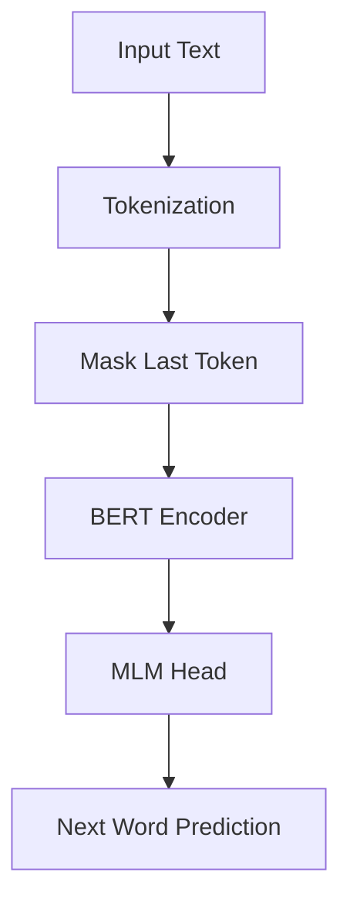

# 🤖 BERT Next Word Prediction

> **Transforming BERT into a Next-Word Oracle** 🔮  
> Fine-tune BERT for causal language modeling and watch it predict the future of your sentences!

[](https://python.org)
[](https://pytorch.org)
[](https://huggingface.co/transformers)
[](LICENSE)

---

## 🌟 What Makes This Special?

This project takes BERT—originally designed for **bidirectional** understanding—and creatively adapts it for **next word prediction**. It's like teaching a scholar who reads entire books at once to become a storyteller who builds narratives word by word!

### ✨ Key Features

- 🎯 **Smart Masking Strategy**: Only masks the last token for focused next-word learning
- 📊 **Real-time Training Monitoring**: Beautiful loss curves and accuracy tracking
- 🚀 **GPU Acceleration**: Optimized for both CPU and CUDA training
- 📈 **Comprehensive Evaluation**: Top-K accuracy metrics with detailed analysis
- 🎨 **Professional Logging**: Training history saved as JSON with visualization
- ⚡ **Memory Efficient**: Gradient accumulation and mixed precision training

---

## 🧠 The Science Behind It

### How We Transform BERT

```
Traditional BERT MLM:    "The cat [MASK] on the mat" → "sat"
Our Approach:           "The cat sat on the [MASK]" → "mat"
```

Instead of random masking, we strategically mask only the **last token**, turning BERT into a next-word prediction engine!

### Architecture Overview



---

## 🚀 Quick Start

### Prerequisites

```bash
pip install torch transformers matplotlib numpy
```

### Basic Usage

```python
from next_bert import ImprovedBERTTrainerNextWord, NextWordEvaluator

# 1. Initialize trainer
trainer = ImprovedBERTTrainerNextWord(use_large=False)

# 2. Train on your data
trainer.train_model(
    train_file="your_data.txt",
    output_dir="./bert-nextword",
    num_epochs=5,
    batch_size=32
)

# 3. Evaluate the model
evaluator = NextWordEvaluator("./bert-nextword/final_model")
predictions = evaluator.predict_next_word("The weather is", top_k=5)
print(f"Next word predictions: {predictions}")
```

---

## 📁 Project Structure

```
next_bert/
├── 📄 next_bert.py              # Main training script
├── 📊 training_curves.png       # Generated loss visualization
├── 📋 training_history.json     # Detailed training metrics
├── 🤖 final_model/             # Saved fine-tuned model
│   ├── pytorch_model.bin
│   ├── config.json
│   └── training_args.bin
└── 📝 dataset.txt            # Your training data
```

---

## 🔧 Configuration Options

### Training Parameters

| Parameter | Description | Default | Recommended Range |
|-----------|-------------|---------|-------------------|
| `num_epochs` | Training epochs | `5` | `3-10` |
| `batch_size` | Batch size per device | `32` | `16-64` |
| `learning_rate` | Learning rate | `2e-5` | `1e-5 to 5e-5` |
| `block_size` | Max sequence length | `256` | `128-512` |
| `validation_split` | Validation data ratio | `0.1` | `0.1-0.2` |

### Model Variants

```python
# Standard BERT (110M parameters)
trainer = ImprovedBERTTrainerNextWord(use_large=False)

# BERT-Large (340M parameters) - Better quality, slower training
trainer = ImprovedBERTTrainerNextWord(use_large=True)
```

---

## 📊 Training Insights

### What You'll See During Training

- **Real-time Loss Monitoring**: Watch your model learn with decreasing loss
- **Learning Rate Scheduling**: Automatic warmup and linear decay
- **Gradient Accumulation**: Effective larger batch sizes on limited hardware
- **Mixed Precision**: Faster training with FP16 when available

### Sample Training Output

```
Using device: cuda
Loaded 50,000 lines from data.txt
Train samples: 45,000
Validation samples: 5,000
Starting training (Next Word Prediction with BERT)...
==================================================
Epoch 1/5: 100%|████████| 1406/1406 [15:32<00:00, loss=2.341]
Evaluation: eval_loss=2.156
...
Model saved to: ./bert-nextword/final_model
Training curves saved: ./bert-nextword/training_curves.png
```

---

## 🎯 Performance & Evaluation

### Metrics We Track

- **Training Loss**: How well the model fits training data
- **Validation Loss**: Generalization performance
- **Top-K Accuracy**: Percentage of correct predictions in top K candidates
- **Learning Rate**: Optimizer scheduling visualization

### Example Evaluation Results

```python
evaluator = NextWordEvaluator("./bert-nextword/final_model")

test_sentences = [
    "The quick brown fox jumps over the lazy",
    "She went to the store to buy some",
    "Artificial intelligence is changing the"
]

# Top-5 accuracy: 78.3%
accuracy = evaluator.evaluate(test_sentences, top_k=5)
```

---

## 💡 Advanced Usage

### Custom Data Collator

The `NextWordPredictionCollator` is the heart of our approach:

```python
class NextWordPredictionCollator:
    def __call__(self, examples):
        # Clone input as labels
        labels = input_ids.clone()
        
        # Mask all tokens except the last one
        labels[:, :-1] = self.ignore_index
        
        # Replace last token with [MASK]
        input_ids[:, -1] = self.mask_token_id
```

### Training Callbacks

Monitor training progress with custom callbacks:

```python
class HistoryCallback(TrainerCallback):
    def on_log(self, args, state, control, logs=None, **kwargs):
        # Log training metrics in real-time
        # Save loss curves and learning rates
```

---

## 🎨 Visualization Features

### Training Curves

The script automatically generates beautiful training visualizations:

- **Loss Curves**: Training vs. validation loss over time
- **Learning Rate Schedule**: Optimizer behavior visualization  
- **High DPI Export**: Publication-ready plots (300 DPI)

### Sample Visualization

```python
# Automatically generated after training
plt.figure(figsize=(12,4))
plt.subplot(1,2,1)
plt.plot(training_history['train_loss'], label='Training Loss')
plt.plot(training_history['eval_loss'], label='Validation Loss')
```

---

## 🛠️ Technical Details

### Memory Optimization

- **Gradient Accumulation**: Simulate larger batch sizes
- **Mixed Precision (FP16)**: Reduce memory usage by ~50%
- **DataLoader Workers**: Parallel data loading
- **Pin Memory**: Faster GPU transfers

### Hardware Requirements

| Setup | Minimum | Recommended |
|-------|---------|-------------|
| **RAM** | 8GB | 16GB+ |
| **GPU VRAM** | 4GB | 8GB+ |
| **Storage** | 2GB | 5GB+ |

---

## 🤝 Contributing

We welcome contributions! Here's how you can help:

1. 🐛 **Bug Reports**: Found an issue? Open an issue!
2. 💡 **Feature Requests**: Have ideas? We'd love to hear them!
3. 🔧 **Code Contributions**: Fork, code, and submit a PR!
4. 📖 **Documentation**: Help improve our docs!

---

## 📚 References & Inspiration

- [BERT: Pre-training of Deep Bidirectional Transformers](https://arxiv.org/abs/1810.04805)
- [HuggingFace Transformers Documentation](https://huggingface.co/transformers/)
- [PyTorch Lightning for Production ML](https://pytorch-lightning.readthedocs.io/)

---

## 🙋‍♀️ Support & Questions

- 💬 **Issues**: Open a GitHub issue for bugs or questions
- 📧 **Contact**: Reach out for collaboration opportunities
- ⭐ **Star**: If this project helped you, consider giving it a star!

---

<div align="center">

**Made with ❤️ and lots of ☕**

*Happy training! May your losses be low and your predictions be accurate* 🎯

</div>
